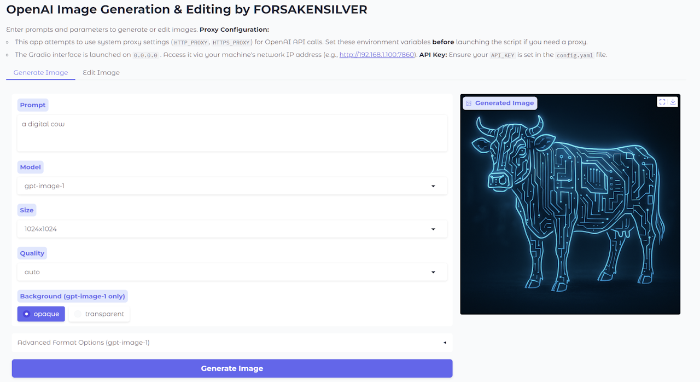

# gpt-image-1-webui

[Chinese below / 中文介绍在下方]


# English

## Introduction

**gpt-image-1-webui** is a Gradio-based web UI for OpenAI gpt-image-1(which is the gpt-4o's web image generation technique) and compatible image generation/editing APIs. Users can generate or edit images with prompts via a simple web interface, with support for model selection, custom size/format/quality.

## Features

- Supports multiple image models (e.g. gpt-image-1, dall-e-3)
- Transparent/opaque background, PNG output
- Simple and user-friendly web UI
- Reads API_KEY and BASE_URL from config.yaml
- Prompt-based image editing

## Installation

1. Clone this repo:
   ```bash
   git clone https://github.com/asasasasasbc/gpt-image-1-webui.git
   cd gpt-image-1-webui
   ```
2. Install dependencies:
   ```bash
   pip install -r requirements.txt
   ```
3. Edit the `config.yaml` file in the root directory:
   ```yaml
   API_KEY: "your OpenAI API key"
   BASE_URL: ""   # If you are using API mirror or proxy, type BASE_URL: "https://YOUR_API_MIRROR_WEBSITE/v1"
   ```

## Run

```bash
python app.py
```

Then open http://127.0.0.1:7860 or your LAN-IP:7860 in your browser.

## Screenshot



---

# 中文

## 简介

**gpt-image-1-webui** 是一个基于 Gradio 的 Web 可视化界面(类似于stable-diffusion-webui)，支持 OpenAI最新的gpt-image-1 (即网页版Gpt-4o的文本图片生成) API 及兼容 API 的图片生成与编辑。用户可以通过 Web 页面输入提示词，一键生成或编辑图片。支持多模型选择、自定义图片大小、格式、质量等参数，并适配代理环境。

## 特性

- 支持多种图片生成与编辑模型（如 gpt-image-1, dall-e-3 等）
- 支持透明/不透明背景，png图片输出
- 简洁的可视化界面，易于使用
- 支持 config.yaml 配置 API_KEY 和 BASE_URL
- 支持图片编辑（基于提示词）

## 安装

1. 克隆本仓库
   ```bash
   git clone https://github.com/asasasasasbc/gpt-image-1-webui.git
   cd gpt-image-1-webui
   ```
2. 安装依赖
   ```bash
   pip install -r requirements.txt
   ```
3. 配置 `config.yaml`
   编辑仓库根目录 `config.yaml`，内容如下（用你的密钥和接口替换）：
   ```yaml
   API_KEY: "你的 OpenAI API 密钥"
   BASE_URL: ""   # 若使用非官方或者代理API，可写为BASE_URL: "https://XXXXXXXXX/v1"
   ```

## 启动

```bash
python app.py
```

运行后访问 http://127.0.0.1:7860 或局域网IP:7860


## 截图


---


**欢迎 PR 和建议！/ Pull requests and suggestions are welcome!**
